<div align="center">

<a href="https://wikiscroll.com">
  <picture>
    <source media="(prefers-color-scheme: dark)" srcset="docs/images/wordmark-dark.svg">
    
  </picture>
</a>

**Replace doomscrolling with discovery.**<br>
A calm, swipeable reader for Wikipedia and Wikivoyage, with no engagement-driven recommendations.

[**Open wikiscroll.com →**](https://wikiscroll.com)

[How it works](docs/ARCHITECTURE.md) · [Engineering notes](docs/ENGINEERING.md) · [Run it yourself](docs/DEVELOPMENT.md) · [Make it your own](docs/DEVELOPMENT.md#make-it-your-own)

<br>

<picture>
  <source media="(prefers-color-scheme: light)" srcset="docs/images/hero-desktop-light.jpg">
  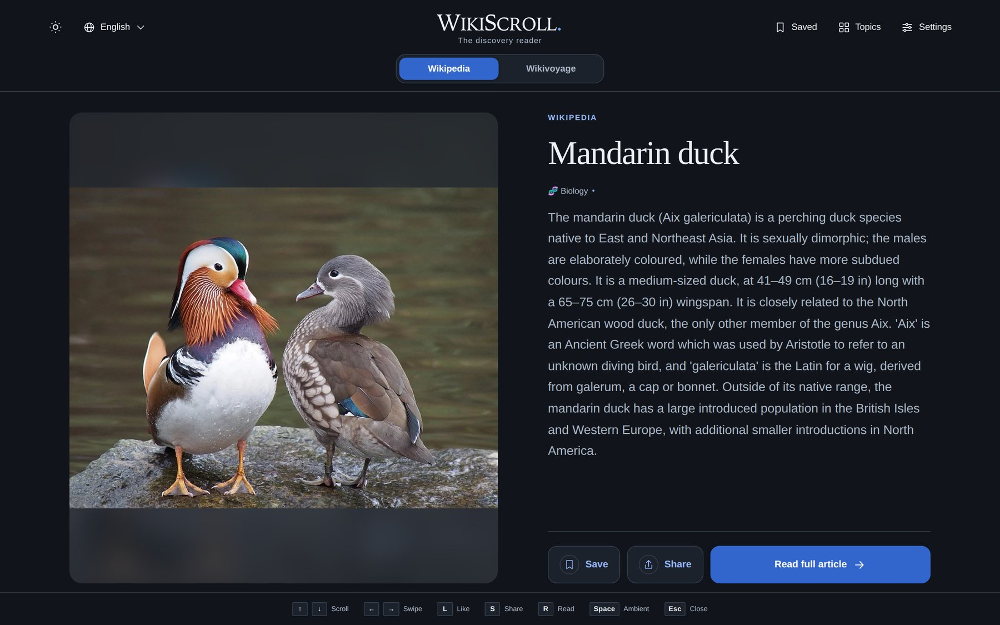
</picture>

</div>

## Why WikiScroll

Spare moments can go to an endless stream of reactions and headlines, or to something worth knowing. WikiScroll shows one article at a time: a photo, a title and an introduction trimmed to whole sentences. Read it, save it, open the full article, or move on.

A few deliberate choices shape the experience:

- **Likes save; they never steer.** Saving an article adds it to your library. It does not change what comes next. Nothing you save, skip or read is sent with a feed request, and [tests](test/randomness.test.js) check that.
- **You choose the filters.** Discovery is random within the topics, depth, language and travel filters you set, and nothing else.
- **No streaks, targets or accounts.** A small daily count and a weekly chart show your reading without turning it into a goal. Everything stays in your browser.

WikiScroll is an independent project. It is not affiliated with or endorsed by the Wikimedia Foundation. Articles belong to their Wikipedia and Wikivoyage authors, and every card links to the original.

## Two ways to explore

<table>
<tr>
<td width="50%" valign="top">

### 📖 Wikipedia · *Discover knowledge*

Random articles with a photo and a readable introduction.

- **Topics:** choose any of 12 subjects (Space, Architecture, Music, Biology, Food, Science, History, Geography, Arts, Technology, People, Sports) or none for a random mix.
- **Article depth:** five steps, from *Popular* (Wikipedia's Level 3 vital articles) and *Known* (Level 4) to *Balanced*, *Niche* and *Obscure*. The last three are based on 14-day readership, adjusted for each language edition's audience size.
- **Help Wikipedia** (English, German, French, Spanish): label cards that need citations or updates, or show only those articles. Each label links to the article so you can improve it.

</td>
<td width="50%" valign="top">

### 🗺️ Wikivoyage · *Explore places*

Community-written travel guides to destinations around the world.

- **Travel filters:** a country or region, and a trip style (nature and hiking, coasts and islands, history and culture, city breaks).
- **Map:** open any guide on a map. WikiScroll uses the guide's own coordinates and falls back to a place-name search.
- **12 editions:** in languages without a large Wikivoyage (Arabic, Korean, Hindi), guides are shown in English with a note.

</td>
</tr>
</table>

<p align="center">
  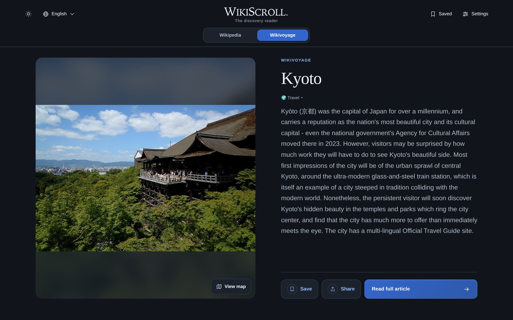
</p>

## Help Wikipedia

Wikipedia is written by volunteers, and much of it still needs work. Editors mark articles that lack sources, need more citations, are out of date or are only a stub, and those marks put each article into hidden maintenance lists. WikiScroll reads those lists so that curiosity can turn into a small contribution. You may be the reader who knows a good source for the lake you just learned about.

In **Settings → Discovery → Help Wikipedia** there are three choices:

- **Off** (default): discovery as usual.
- **Show tags:** cards that need work get a small tag next to their category, naming the most useful fix (*No sources*, *Needs citations*, *Citation needed*, *Needs updating*, *Needs more detail* or *Short article*). The tag links straight to the article on Wikipedia.
- **Only these articles:** the feed is filled with articles that need work, sampled from random points across Wikipedia's maintenance lists. It combines with topics and depth, so you can look for, say, history articles that need citations.

<table>
<tr>
<td width="62%">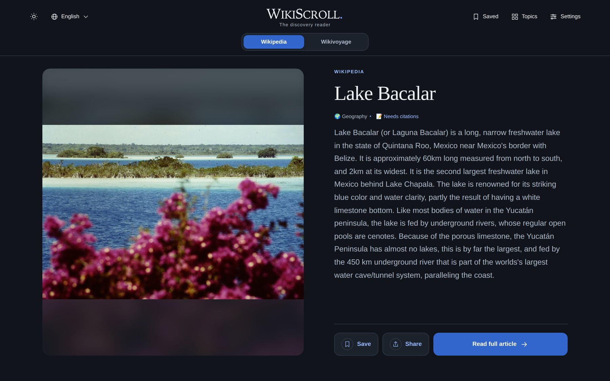</td>
<td width="38%">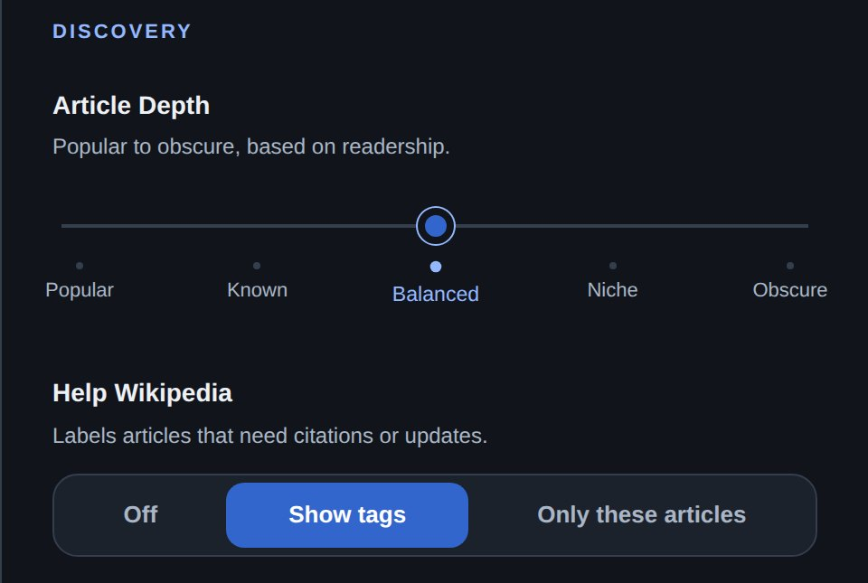</td>
</tr>
</table>

Help Wikipedia is available for English, German, French and Spanish Wikipedia, the editions whose maintenance lists are large and flat enough to sample reliably. WikiScroll doesn't edit anything itself: improvements happen on Wikipedia, under its own guidelines. Tags reflect Wikipedia's lists when the article was fetched, so a recently fixed article may still show one for a while.

## On phones

<table>
<tr>
<td align="center" width="33%">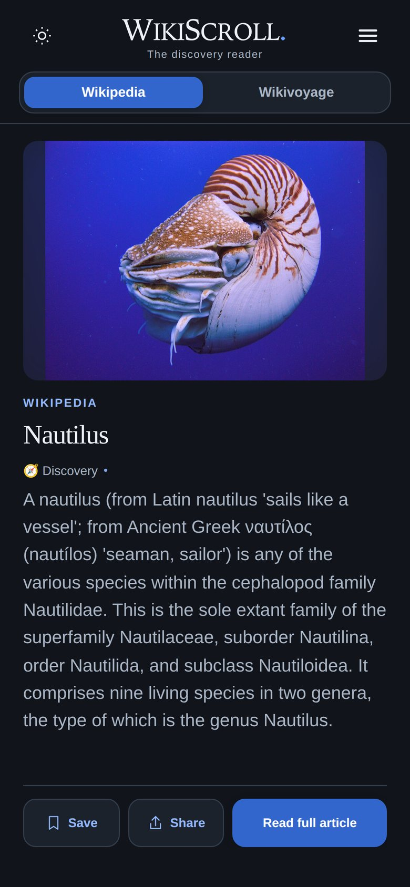<br><sub><b>Wikipedia</b> · one card at a time</sub></td>
<td align="center" width="33%">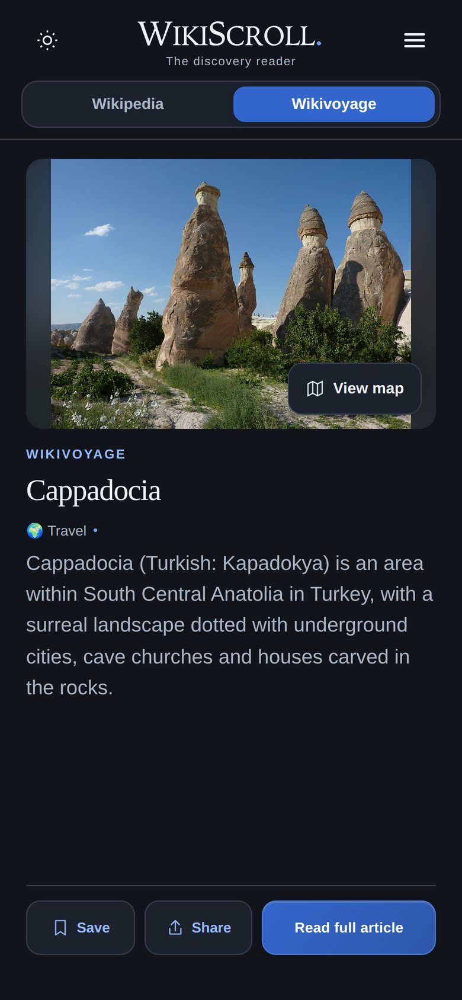<br><sub><b>Wikivoyage</b> · destinations and maps</sub></td>
<td align="center" width="33%"><br><sub><b>Swipe right to save</b>, left to skip</sub></td>
</tr>
<tr>
<td align="center">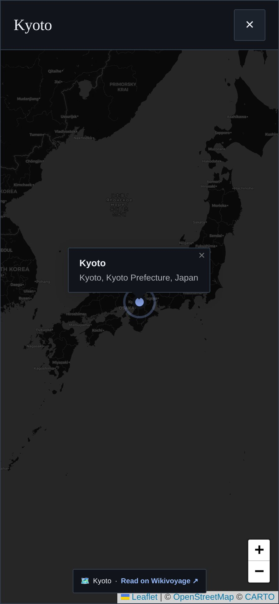<br><sub><b>Map</b> · pinned from the guide's coordinates</sub></td>
<td align="center">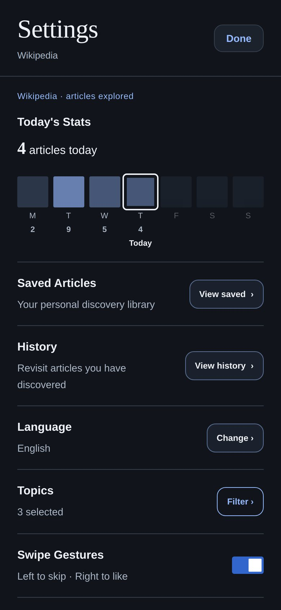<br><sub><b>Settings</b> · gentle stats, no streaks</sub></td>
<td align="center">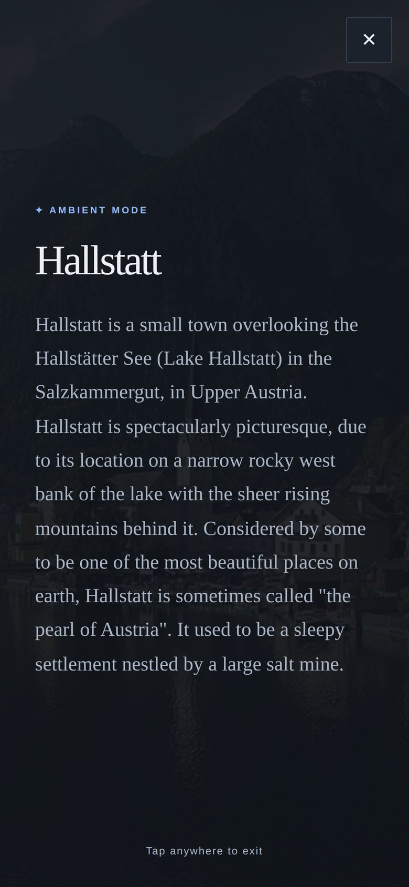<br><sub><b>Ambient mode</b> · long-press a card</sub></td>
</tr>
</table>

## Ambient reading

Press <kbd>Space</kbd> on desktop, or long-press a card on a phone, and everything else steps back: the introduction is set in large serif type over a dimmed version of the article's photo. Press <kbd>Space</kbd> again or tap anywhere to return.

<p align="center">
  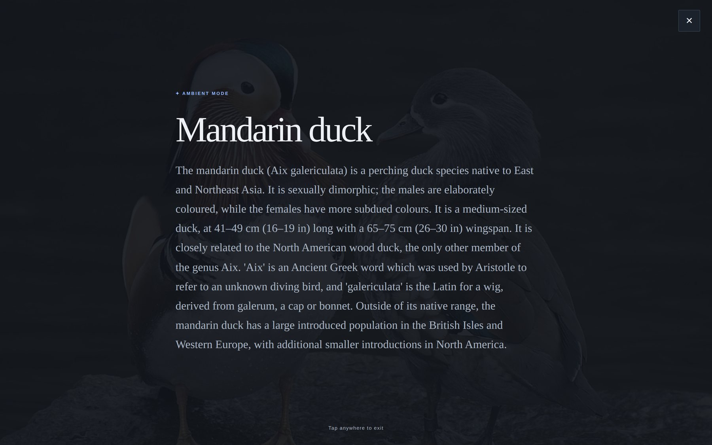
</p>

## Collections you can share

Group saved articles into named collections, and share one as a link. The link opens a page on wikiscroll.com where every title, excerpt and image has been checked again against Wikimedia. Recipients can save their own copy, and messaging apps show a generated preview card.

<table>
<tr>
<td align="center" width="36%">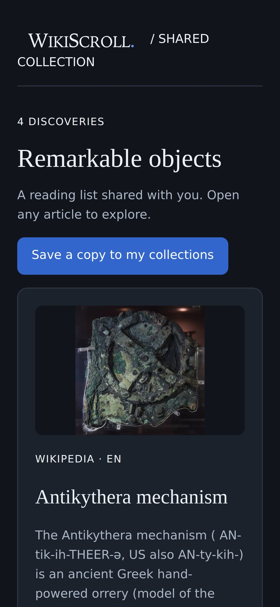</td>
<td align="center" width="64%">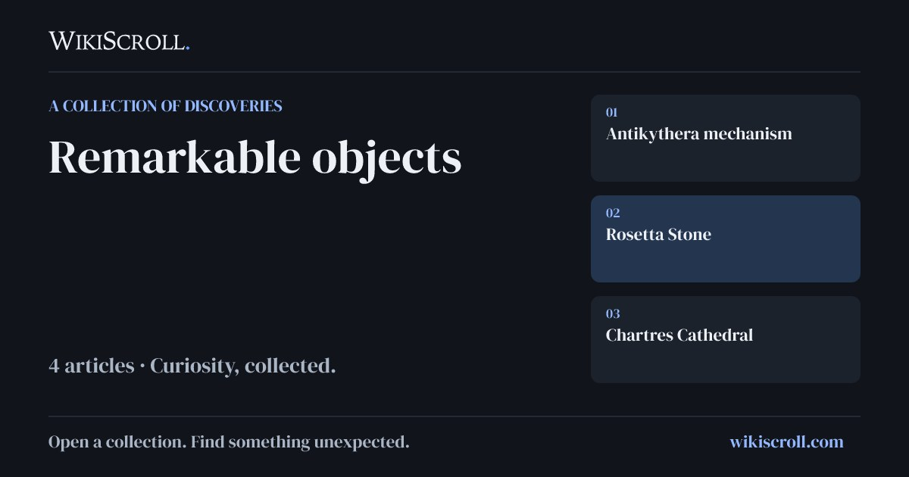<br><sub>The preview image, rendered by the Worker for link previews</sub></td>
</tr>
</table>

## Features

| | |
|---|---|
| **Reading** | Full-height cards with introductions trimmed to whole sentences that fit the screen. Ambient mode. An occasional "On this day" badge marks people and events tied to today's date. |
| **Your library** | Saved articles (also kept in IndexedDB for offline reading), reading history for the last 50 articles, and named collections. |
| **Sharing** | Article links get a proper preview in messaging apps. Collections are shared as a snapshot of up to 30 articles, verified again when the link is opened. |
| **Languages** | 15 content languages, and the interface translated into all of them. Arabic and Hebrew get a right-to-left layout. |
| **Input** | Touch swipes, double-tap to save, pull to refresh, mouse drag, two-finger trackpad swipes, and keyboard shortcuts. |
| **Install and offline** | Installable as a Progressive Web App. The app shell and recently viewed images are cached, so saved articles and cached content work offline. New discoveries and maps need a connection. |
| **Appearance** | Dark theme by default, with a light theme. Responsive layouts for phones, tablets and wide desktops. |

<details>
<summary><b>Keyboard shortcuts</b></summary>

| Key | Action |
|---|---|
| <kbd>↓</kbd> / <kbd>↑</kbd> | Next / previous card |
| <kbd>→</kbd> / <kbd>←</kbd> | Save and continue / skip |
| <kbd>L</kbd> | Save or unsave |
| <kbd>S</kbd> | Share |
| <kbd>R</kbd> | Read the full article |
| <kbd>M</kbd> | Map (Wikivoyage) |
| <kbd>Space</kbd> | Ambient mode |
| <kbd>Esc</kbd> | Close panels and dialogs |

Shortcuts are ignored while a panel or dialog is open, while typing, and when a modifier key is held, so browser shortcuts keep working.

</details>

## Designed with care

The interface is meant to feel calm and predictable. A lot of that comes from small details:

- **The visible card is protected.** Swipes, resizes, rotations and background clean-up never move you away from the article you are reading. If the next card isn't ready, a swipe springs back instead of showing an empty screen.
- **Gestures do one thing.** A trackpad swipe and its momentum count as one action. Swiping right or double-tapping only ever saves; it never removes a save. Vertical scrolling, pinch-zoom and small movements don't trigger anything.
- **Text fits the card.** Introductions are measured against the space available and cut at sentence boundaries (using `Intl.Segmenter` where available), so there is no scrolling inside cards and no text cut mid-line.
- **Accessibility.** Native `<dialog>` modals with Escape and outside-click dismissal. Closed drawers are made `inert`. Switches and radio groups use proper ARIA roles and states. Notifications are announced with `role="status"`. Form inputs are at least 16 px, and pinch-zoom is never disabled.
- **Reduced motion.** With `prefers-reduced-motion`, transitions, card flights, smooth scrolling and map fly-to animations are replaced by instant changes.
- **Translations stay local.** Interface labels are translated from bundled dictionaries in the browser. Article text is never sent to a translation service.

## How it works

WikiScroll is a static front end plus one [Cloudflare Worker](https://developers.cloudflare.com/workers/). It uses plain JavaScript with no framework and no build step for the app itself.

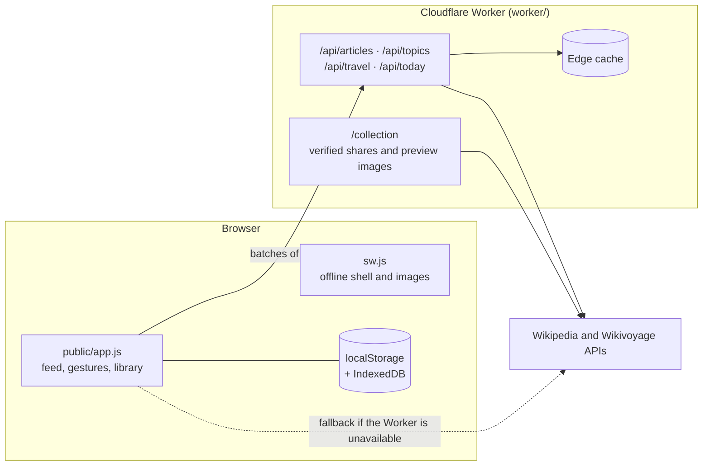

The browser keeps a reserve of cards ready ahead of the one you're reading. The Worker picks candidates from Wikimedia, completes their pageviews and introductions in parallel batches, filters them by depth, and caches the results at the edge. [docs/ARCHITECTURE.md](docs/ARCHITECTURE.md) has a map of the code.

## Engineering highlights

Discovery depends on public APIs that can be slow, rate-limited or briefly unavailable. Most of the work in this codebase goes into keeping the reader moving anyway:

- **Supply ahead of the reader:** a bounded queue (60 to 100 articles, 16 cards rendered ahead) with retries that back off exponentially.
- **No repeats:** duplicate checks across queued and displayed cards, and randomized batch slots so readers don't all receive the same cached selection.
- **Accurate depth:** Wikimedia returns pageviews for only 5 pages per request, so the rest are fetched in chunks. Missing data is never treated as "obscure". Depth ranges are adjusted per language.
- **Deadlines:** each upstream call has a 6-second limit, and the main feed answers within a 6.5-second budget. If time runs out, the Worker answers with the cards that are complete and finishes the rest in the background.
- **Rate-limit awareness:** `429` and `Retry-After` pause only the affected host, in both the Worker and the browser.
- **Stale-while-revalidate:** cached supply is served immediately and refreshed in the background, and yesterday's cards stay available during an outage.
- **No stale replies:** every request carries a feed generation number, so a slow reply meant for the previous source, language or filter can never appear in the new feed.
- **Shared links are verified:** shared collections carry only article IDs. Titles, excerpts and images are fetched again from Wikimedia, escaped, and checked against strict limits before anything is rendered.

[docs/ENGINEERING.md](docs/ENGINEERING.md) walks through each of these with code references, and covers what the test suite does and doesn't verify.

## Run it yourself

You need [Node.js 22+](https://nodejs.org/) and [pnpm](https://pnpm.io/).

```bash
git clone https://github.com/Golps/WikiScroll.git
cd WikiScroll
pnpm install
pnpm dev          # wrangler dev at http://localhost:8787
```

Run the tests. They use Node's built-in test runner and need no installed dependencies or network access:

```bash
node --test test/*.test.js
```

> [!NOTE]
> Wikivoyage maps use [CARTO](https://carto.com/) basemaps and work without any setup. The production map key isn't included. For a public deployment, add your own domain-restricted key and check CARTO's usage terms. See [configuration](docs/DEVELOPMENT.md#configuration).

**Two ways to host it:**

- **Cloudflare Workers** (how wikiscroll.com runs): the full app, including topic filters, travel filters, Help Wikipedia, "On this day", shared collection pages and link previews. See [Deploying](docs/DEVELOPMENT.md#deploying).
- **Any static host, such as GitHub Pages:** serve the `public/` folder as plain files. The browser then reads Wikipedia and Wikivoyage directly, and the core reader works: random feeds, depth, languages, saves, collections, ambient mode, maps and offline reading. Worker-only features don't. See [Static hosting](docs/DEVELOPMENT.md#static-hosting-github-pages-and-similar) for the exact list.

[docs/DEVELOPMENT.md](docs/DEVELOPMENT.md) also covers configuration and [making it your own](docs/DEVELOPMENT.md#make-it-your-own).

## Known limitations

This repository is a snapshot of the code behind wikiscroll.com. It isn't finished, and these limitations are known:

- **Browser-only storage.** Saves, collections and history live in your browser, with no account sync. Clearing site data removes them, and Safari may clear them after about 7 days without a visit.
- **Shared collections can't be revoked.** A shared link contains its snapshot. Deleting the collection locally doesn't disable a link that was already shared.
- **Coverage varies by language.** Help Wikipedia is available in 4 languages. Category labels on cards are English-only. Wikivoyage covers 12 editions.
- **Built for wikiscroll.com.** Share links, preview URLs and cache keys use that domain. See [Make it your own](docs/DEVELOPMENT.md#make-it-your-own) before deploying elsewhere.
- **Ambient text on small screens.** On a phone, a long introduction can run past the bottom of ambient mode and be cut off.
- **Testing limits.** The automated tests run in Node. They don't cover real browsers or physical iOS and Android devices; see [what the tests cover](docs/ENGINEERING.md#testing).

## Forking and contributing

You're welcome to study this code, fork it and build something of your own. This repository is published as a reference snapshot and isn't actively maintained, so issues and pull requests may not get a response. [CONTRIBUTING.md](CONTRIBUTING.md) has more detail. To report a security problem with wikiscroll.com, follow [SECURITY.md](SECURITY.md) instead of opening a public issue.

If WikiScroll is useful to you, a ⭐ on the repository helps others find it.

## Credits and attribution

- Article text and images come from [Wikipedia](https://www.wikipedia.org/) and [Wikivoyage](https://www.wikivoyage.org/) contributors. Text is available under [CC BY-SA 4.0](https://creativecommons.org/licenses/by-sa/4.0/). Each image has its own license on Wikimedia Commons. WikiScroll links every card to its source for full attribution. Photos in this README are credited in [docs/images/ATTRIBUTION.md](docs/images/ATTRIBUTION.md).
- Maps use [Leaflet](https://leafletjs.com/), [OpenStreetMap](https://www.openstreetmap.org/copyright) data, [CARTO](https://carto.com/attributions) basemaps and [Nominatim](https://nominatim.org/) search.
- Globe artwork uses [Natural Earth](https://www.naturalearthdata.com/) data (public domain). Shared-collection images use [DM Serif Display](https://github.com/googlefonts/dm-fonts) (SIL Open Font License 1.1).

[THIRD_PARTY_NOTICES.md](THIRD_PARTY_NOTICES.md) has the full list.

## License

The code is released under the [MIT License](LICENSE). You're free to use, modify and build on it, as long as you keep the copyright notice.

The license covers the code only. The WikiScroll name and logo are not licensed for reuse, so please give your fork its own name and look. Wikipedia and Wikivoyage content, photos, map data and the bundled font keep their own licenses, listed in [THIRD_PARTY_NOTICES.md](THIRD_PARTY_NOTICES.md).
