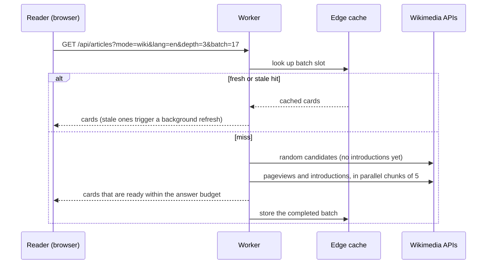

# Architecture

This page describes how WikiScroll is organized: where things live and which rules hold across the codebase. For the reasoning behind the reliability work, see [ENGINEERING.md](ENGINEERING.md). For setup and deployment, see [DEVELOPMENT.md](DEVELOPMENT.md).

## Bird's-eye view

WikiScroll has two parts, deployed together as a single Cloudflare Worker with static assets:

1. **A static front end** (`public/`). Plain HTML, CSS and JavaScript, served as-is. There is no framework, bundler or compile step. The browser holds all user data (saved articles, collections, history, settings) in `localStorage`, with IndexedDB as a second copy of saved articles.
2. **A Worker** (`worker/`). It answers a few JSON endpoints that turn Wikimedia's APIs into ready-to-read cards. It also renders previews for shared links and collections. It has no database: its only state is Cloudflare's edge cache, in-memory maps for coalescing requests, and rate-limit bindings.



The browser asks the Worker for batches and keeps a reserve queued ahead of the card on screen. If the Worker can't be reached, the browser calls the Wikimedia API directly, with its own deadlines and request budget.

## Code map

### `public/`: the browser app

| File | Responsibility |
|---|---|
| `index.html` | App shell: header, feed container, settings drawers, dialogs, the crawlable text shown without JavaScript, and a copy of the About page. |
| `app.js` | The core: constants, state and persistence, the supply queue, card rendering, likes and collections, settings, gestures (touch, mouse, trackpad, keyboard), maps and "On this day". |
| `atlas.js` | Presentation only: fitting excerpts to the space available, making closed drawers `inert`, keeping the current card in place across resizes, dialog dismissal, theme metadata. |
| `features.js` | Wikivoyage travel filters, and sharing and importing collection snapshots. |
| `discovery.js` | The dismissible "follow your curiosity" hint for first-time readers. |
| `i18n.js` + `translations.js` | Interface localization from bundled dictionaries, applied through a `MutationObserver`. Article text is excluded. |
| `sw.js` | Service worker: offline app shell, network-first page loads with a 2.5-second fallback to cache, and a cache of up to 80 Wikimedia images. |
| `styles.css` | All styling, including the dark and light themes, responsive layouts, RTL and reduced-motion rules. |
| `data/starter-en.json` | A small bundled set of English articles, used for an instant first screen when no filters are set. See [STARTER-SOURCES.md](STARTER-SOURCES.md). |
| `about/` | The crawlable About page. `scripts/build-about.mjs` copies its content into the in-app About dialog. |

### `worker/`: the Cloudflare Worker

| File | Responsibility |
|---|---|
| `index.js` | Entry point and routing. Builds `/api/articles` and `/api/travel` batches, bounds upstream calls (`upstream`), serves link-preview HTML to bots, serves static assets, and optionally injects the analytics beacon. |
| `topics.js` | `/api/topics`: samples articles for a topic by walking random branches of Wikipedia's category tree, then filters them by depth. |
| `vital.js` | *Popular* and *Known* depths: builds and caches Wikipedia's Level 3 and Level 4 vital-article lists, and maps them to other languages through interlanguage links. |
| `pageviews.js` | Completes pageview data 5 pages at a time, averages views while ignoring publication lag, and scales depth ranges per language. |
| `extracts.js` | Fetches introductions separately, in parallel chunks of 5. |
| `needs.js` | Help Wikipedia: finds maintenance needs through hidden tracking categories, and samples articles that need work. |
| `today.js` | `/api/today`: parses Wikipedia's "On this day" feed into exact page-ID matches and occasional surprise cards. |
| `collections.js` | Decodes and validates shared collections, and renders the collection page and its SVG preview. |
| `verified.js` | Fetches article metadata again from Wikimedia by page ID, for shared links and collections. |
| `collection-image.js` | Converts the collection SVG to PNG with `resvg-wasm` and the bundled font. It loads only when needed. |
| `security.js` | Rate-limit checks that fail closed, the `429` response, and security headers on every response. |
| `wordmark.js` | The logo as SVG path data, for generated images. |

### Everything else

| Path | Purpose |
|---|---|
| `test/` | `node --test` suites for the Worker modules, plus browser logic extracted from `public/*.js` and run in `node:vm` sandboxes. |
| `scripts/` | `deploy.sh` (token-scoped deployment), `build-about.mjs`, `build-branding.mjs` (regenerates icons and the share image). |
| `branding/` | Logo sources and the Natural Earth geometry used to draw the globe on the share image. |
| `wrangler.jsonc` | Worker configuration: static assets, the three rate-limit bindings, observability. |
| `docs/` | This documentation and the images used in the README. |

## Data model

Articles move through the system in one small shape:

```js
{ id: 'w12345',            // 'w' = Wikipedia, 'v' = Wikivoyage, then the page ID
  src: 'wiki',             // 'wiki' | 'how' (Wikivoyage)
  title, body,             // plain text, stripped of HTML
  img: 'https://upload.wikimedia.org/…',
  url: 'https://en.wikipedia.org/wiki/…',
  desc?, topic?, needs? }  // short description, requested topic, maintenance needs
```

The browser stores data under stable keys: `ws_liked`, `ws_collections`, `ws_history`, `ws_settings`, `ws_topics`, `ws_travel_filters`, `ws_stats_*`, `ws_weekly_*` and `ws_feed_reserves`, plus the `wikiscroll` IndexedDB database. These keys are part of the app's compatibility contract: changing them would erase readers' libraries.

## Invariants

These rules hold across the codebase, and many are enforced by tests. Changes should preserve them.

- **No personalization from behavior.** Feed requests contain only the reader's explicit choices: source, language, depth, topics, Help Wikipedia mode and travel filters. Likes, history and previous cards never affect selection.
- **Depth means readership, not length.** Excerpt length is never used as a stand-in for depth. Pages with unknown readership never qualify as *Obscure*.
- **One feed generation at a time.** Changing source, language or filters increments `fillGeneration`, aborts in-flight requests and cancels animations. Any reply or animation frame from an older generation is discarded.
- **The visible card is never lost.** Clean-up, resizes, supply gaps and gestures keep the reader on the article they are reading.
- **Swipe right only saves.** Swiping right and double-tapping add a save and never remove one. Only the Save button and <kbd>L</kbd> toggle.
- **Shared content is re-verified.** Collection links carry IDs. Displayed titles, excerpts and images come from Wikimedia, not from the link.
- **Rate limits fail closed.** If a rate-limit binding is missing or errors, the Worker refuses expensive work instead of doing it without a limit.
- **Mirrored tables stay identical.** `app.js` keeps copies of `VIEW_SCALE`, the list of Wikivoyage languages and `HELP_LANGS` from the Worker. Tests fail if they drift.
- **No dead CSS.** `test/unused-css.test.js` fails when a style rule targets a class or ID that no page or script uses.

## Cross-cutting concerns

- **Caching layers:** browser (queued cards in memory, saved reserves in `localStorage`, service-worker cache), then Worker (in-flight request maps, per-isolate memory for the vital-article lists), then the Cloudflare edge cache (article batches and topic batches for 24 hours, complete travel search pages for 1 hour, vital-article lists for 7 days, "On this day" data for 6 hours, verified metadata for 24 hours).
- **Cache versioning:** cache keys include a version (`version=5` for articles, `v=5` for topics). Front-end assets use `?v=` query strings that must match the `SHELL` list and the `CACHE` name in `sw.js`.
- **Security headers:** `secure()` in `worker/security.js` adds `nosniff`, `DENY` framing, a strict referrer policy, a permissions policy and HSTS to every response. Generated pages set their own strict CSP.
- **Localization:** interface strings are translated by text match in `i18n.js`, with templates for messages that contain a collection name or a count (`Added to "{name}"`). New labels need entries in `translations.js` for every language; `test/i18n.test.js` checks the core controls.
