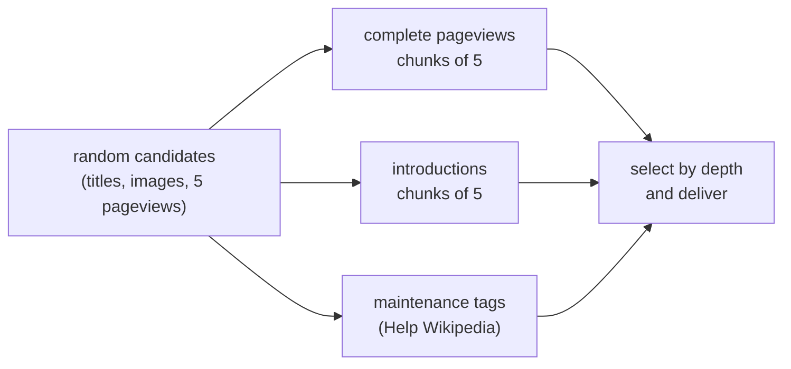

# Engineering notes

WikiScroll looks simple: one card, then the next. Behind that are public APIs that can be slow, rate-limited or briefly unavailable, readers who swipe faster than articles load, and settings that can change mid-request. This page explains how the code handles those conditions, with short excerpts from the source.

Everything described here is implemented unless it is marked as a known issue. Line numbers change often, so references name files and functions instead.

- [1. Keeping cards ahead of the reader](#1-keeping-cards-ahead-of-the-reader)
- [2. Random discovery without repeats](#2-random-discovery-without-repeats)
- [3. Depth from real readership](#3-depth-from-real-readership)
- [4. The Worker's request pipeline](#4-the-workers-request-pipeline)
- [5. Deadlines, rate limits and retries](#5-deadlines-rate-limits-and-retries)
- [6. Stale responses after a change](#6-stale-responses-after-a-change)
- [7. Protecting the visible card](#7-protecting-the-visible-card)
- [8. Shared links and collections](#8-shared-links-and-collections)
- [9. Performance choices](#9-performance-choices)
- [Testing](#testing)
- [Known issues](#known-issues)

---

## 1. Keeping cards ahead of the reader

*`public/app.js`: `fillQueue`, `ensureFeedAhead`, `scheduleRefill`, `acceptSupply`*

The browser keeps two separate buffers: a data queue of articles and a small window of rendered cards.

```js
// Data reserve is deliberately much larger than the rendered window.
const QUEUE_MIN = 60, QUEUE_TARGET = 100, CARDS_AHEAD = 16;
```

- **Rendering is bounded.** At most 16 cards are rendered ahead of the current one. Images for the next 24 queued articles are preloaded into an in-memory cache of 100 images.
- **Refills are bounded.** A refill makes at most 5 requests and stops at 100 queued articles. Concurrent refill calls share the same task instead of starting new ones.
- **Retries back off.** When the queue falls below 60, a refill is scheduled with exponential backoff (700 ms × 1.6ⁿ, capped at 10 s). Retries pause while the tab is hidden or offline, and restart when the connection returns.
- **Starting fast.** On load, the reader first sees articles saved from the previous session for the exact same settings (up to 7 days old). With no filters set, it can also use a small bundled English starter set. Explicit filters are never replaced by that generic English content.

## 2. Random discovery without repeats

*`public/app.js`: `acceptSupply`, `fetchWorkerBatch`. `worker/index.js`: `articles`*

Every article that enters the queue is recorded in a session-wide `feedSeen` set, so a card can't appear twice, whether it arrives from the Worker, the reserve, the starter set or a direct fallback. Batches are shuffled as they arrive.

The Worker caches supply in **64 batch slots** per source, language and depth. Each browser starts at a random slot and moves through them in turn, so readers don't all receive the same cached selection:

```js
let workerBatch = Math.floor(Math.random()*64);
// …
batch: String(workerBatch++ % 64)
```

Topic feeds sample 6 random branches of a topic's category tree, go down 2 or 3 levels, and then interleave the branches so one dense branch can't fill a batch (`diverseDepth` in `worker/topics.js`). Help Wikipedia samples maintenance lists that contain hundreds of thousands of titles, sorted alphabetically. It makes 10 short reads of 8 titles, each starting at a random two-letter prefix, instead of one long run through "A" (`sampleNeedyTitles` in `worker/needs.js`).

Nothing about the reader's behavior goes into these choices. The browser sends only the settings it displays; `test/randomness.test.js` checks that saves, unsaves and history leave the feed and its requests unchanged.

## 3. Depth from real readership

*`worker/pageviews.js`, `worker/vital.js`, `worker/index.js`: `selectArticles`*

The depth control is one of the more carefully built parts of the app. Its five steps are based on how much an article is actually read, not on proxies like excerpt length:

| Step | Source |
|---|---|
| 1 · Popular | Wikipedia's [Level 3 vital articles](https://en.wikipedia.org/wiki/Wikipedia:Vital_articles/Level/3) (~1,000) |
| 2 · Known | Level 4 minus Level 3 (~9,000), read from the eleven Level 4 topic lists |
| 3 · Balanced | ≥ 10 average daily views over 14 days |
| 4 · Niche | 2 to 30 daily views |
| 5 · Obscure | ≤ 2 daily views |

(Topic feeds use similar, slightly different ranges, defined in `worker/topics.js`.)

The Worker handles three quirks of Wikimedia's data:

**Pageviews arrive for only five pages per request.** The random query returns pageviews for the first five pages in alphabetical order and silently leaves out the rest. Without a fix, depth filtering would see a quarter of its candidates and favor titles starting with early letters. `completePageviews` fetches the missing pages in parallel chunks of five.

**Missing data isn't zero.** A day that is `null` for *every* page is publication lag and is excluded. A `null` day for one page is a real zero. A page with no counted day at all stays *unknown*:

```js
// A page with no counted day at all stays unknown: an outage must never
// make a famous article qualify as an obscure discovery.
return known && days ? sum / days : null;
```

**Language editions differ in size.** Readership ranges are set for English and scaled per edition. The factors come from comparing percentiles of daily views for random illustrated articles in each language (September 2026):

```js
export const VIEW_SCALE = {en:1, ja:1, ru:0.6, de:0.5, he:0.4, fr:0.3, it:0.25, pt:0.25,
                           es:0.25, pl:0.2, zh:0.2, ko:0.2, hi:0.15, ar:0.15, nl:0.1};
```

If too few candidates fall in range, at most three of the closest ones are added, so the depth steps stay distinct. *Popular* and *Known* used to be based on the daily most-read chart, but that chart is dominated by news, celebrities and automated traffic, so it was replaced with the editor-curated vital-article lists. Those lists are cached for a week, and an incomplete list is never cached.

## 4. The Worker's request pipeline

*`worker/index.js`: `startBatch`, `articles`. `worker/extracts.js`*

**Candidates first, text second.** Introductions (TextExtracts) are the slowest part of a Wikimedia query, because the API renders each page before trimming it. Twenty cold pages in one request could exceed the timeout; the code notes about 4.9 s for Russian Wikipedia and over 12 s for German Wikivoyage. So the random query asks for no text at all, and introductions are fetched afterwards in parallel chunks of five:



**Two samples, first one wins.** For Wikipedia, two random queries run at once (up to 40 candidates). Whichever sample finishes first delivers cards immediately. The merged result is cached after both finish.

**Request coalescing.** Identical requests share one in-flight task (the `inFlight` map keyed by cache URL). The same pattern appears for topics, vital-article lists, "On this day", verified metadata and collection image rendering.

**Stale data is served while it refreshes.** A cached batch is fresh for 60 seconds and kept for 24 hours:

```js
if (valid && age < RETAIN_SECONDS*1000) {
  const stale = age >= FRESH_MS;
  if (stale && await permit(env,'WORK_LIMIT','feed'))
    ctx.waitUntil(startBatch(key,lang,mode,depth,cache,ctx).complete);
  return json({...stored, articles: stored.articles.slice(0,n), stale}, 200, {'X-Cache': stale ? 'STALE' : 'HIT'});
}
```

During a Wikimedia outage, readers keep getting the last good batch while refresh attempts continue in the background. Empty results are never cached.

## 5. Deadlines, rate limits and retries

*`worker/index.js`: `upstream`, `retryDelay`, `within`. `public/app.js`: `fetchOne`, `fetchWorkerBatch`*

**One deadline covers the whole call.** `upstream()` races the request, *including reading the response body*, against a 6-second timer. That bounds the call even if the upstream server ignores the abort signal.

**An answer budget.** The browser stops waiting after 7.5 seconds. The Worker answers within 6.5 seconds with whatever cards are complete, and lets the rest finish in the background to fill the cache:

```js
let result = await within(pending.ready, RESPONSE_BUDGET_MS);
if (!result) result = {articles: pending.snapshot(), cached_at: new Date().toISOString()};
```

Pages are added to the snapshot before their text arrives, and selection skips pages without an introduction, so a snapshot contains only complete cards.

**Per-host cooldowns.** A `429` response, or a `503` with `Retry-After`, pauses that one host (for example `de.wikipedia.org`) for the requested time. `Retry-After` is read as seconds or as an HTTP date, with a minimum of 1 second and a default of 30. Calls during a cooldown return `null` immediately instead of adding to the load. The browser follows the same rule for its direct fallback calls, and applies a separate cooldown of 2 to 60 seconds to the Worker itself.

**Fail-closed limits.** Three Cloudflare rate-limit bindings meter requests per IP (`REQUEST_LIMIT`), upstream work (`WORK_LIMIT`) and image rendering (`RENDER_LIMIT`). If a binding is missing or throws, `permit()` returns `false`.

## 6. Stale responses after a change

*`public/app.js`: `resetFeed`, `fillGeneration`*

Changing source, language, topics, depth or travel filters resets the feed:

```js
fillGeneration++;
supplyControllers.forEach(controller => controller.abort());
articles = []; queue = []; feedSeen.clear(); …
```

Every asynchronous step records the generation it started in and checks it again before it touches state. A slow reply from before the change is discarded, even if the abort came too late to stop it. Queued articles are only reused for the exact same combination of source, language, depth, topics and filters (`feedContextKey`). Animations follow the same rule: a `feed-reset` event cancels any card flight in progress, so a leftover animation frame can't move the new feed.

## 7. Protecting the visible card

*`public/app.js`: `pruneOldCards`, `flyOff`. `public/atlas.js`: `installViewportContinuity`*

- **Clean-up keeps your position.** Cards more than 12 positions behind the current one are removed after scrolling stops. Before removing them, the code records the current card's offset and restores it exactly afterwards, with scroll anchoring and snapping briefly disabled.
- **Swipes move one card smoothly.** A single animation loop moves the outgoing card sideways and scrolls the feed to the next card, landing exactly on it so scroll snapping never corrects the position. If there is no next card yet, the swipe springs back instead of leaving an empty screen.
- **Resizing and rotation** re-anchor the article you were reading after the card height changes.
- **Positions come from the layout.** They are calculated from the cards' layout offsets, not `window.innerHeight`, because mobile browser toolbars change the viewport height while you scroll.
- **Trackpad momentum doesn't repeat.** A horizontal trackpad gesture, including its momentum tail, triggers at most one action.

## 8. Shared links and collections

*`worker/collections.js`, `worker/verified.js`, `worker/index.js`: `renderUnfurl`*

A shared collection is a base64url snapshot in the link: a name and up to 30 article IDs. Before it's used, the Worker applies these checks:

1. **Strict decoding.** At most 12,000 characters, a name of at most 80 characters, and 1 to 30 unique items. Each ID must match `^[wv][1-9]\d{0,11}$` and use a supported language. Any other properties are dropped.
2. **Verification.** Each article is fetched again by page ID from its Wikimedia host, 4 at a time. Only articles in the main namespace are accepted, and images only from `upload.wikimedia.org` or `thumb.wikimedia.org`. If any article can't be verified, the page returns `503` instead of showing the text from the link.
3. **Safe rendering.** All text is HTML-escaped. The collection page has a strict CSP (`default-src 'none'`, with images allowed only from Wikimedia). The preview image is SVG, rasterized in the Worker, and cached by a SHA-256 hash of the verified snapshot.

Article links (`?a=w123&lang=es`) follow the same rules. Readers get the normal app. Link-preview bots such as Slack, Discord and WhatsApp get verified `noindex` metadata. Search crawlers get the canonical app, so article previews never compete with Wikipedia in search results.

## 9. Performance choices

- **Loaded only when needed.** Leaflet (JS and CSS) loads from cdnjs the first time a map opens, with a 10-second timeout and a retry after failure. The PNG renderer (`resvg-wasm` and the font) is imported only for collection preview images.
- **Images.** The first card's photo loads eagerly with `fetchpriority="high"`; all others load lazily. A failed image falls back to a globe illustration instead of an empty box.
- **Fewer requests.** The Wikivoyage fallback makes one request for 20 candidates. It replaced an earlier approach that made up to 80 requests per refill and triggered Wikimedia's per-IP limits.
- **Memory over long sessions.** Removed cards give up their article data and their `ResizeObserver` subscriptions, so long reading sessions don't keep detached nodes around.
- **No build step.** The front end is served exactly as written. Cache-busting uses `?v=` query strings kept in sync with the service worker's `SHELL` list.

## Testing

The suite has **207 tests** in 24 files. It runs with `node --test test/*.test.js` in about 2 seconds, with no installed dependencies and no network access. Wikimedia, the edge cache, rate-limit bindings and timers are replaced with fakes.

**What it verifies:**

- Worker behavior: parameter validation, caching and stale refreshes, request coalescing, deadlines and partial answers, per-host cooldowns, pageview completion and depth ranges, vital-article sampling, topic sampling, travel search (several places, relevance, pagination, resuming unfinished guides, first-paragraph fallback, the subrequest budget, phrasebooks in every edition, spelling suggestions), "On this day" parsing, Help Wikipedia, collection decoding, verification and escaping, bot previews, security headers, the page's Content Security Policy, and the absence of CORS headers on the API.
- Browser logic, extracted from `public/*.js` and run in `node:vm` sandboxes: supply and duplicate rejection, stale-generation handling, request budgets and cooldowns, gesture and trackpad rules, clean-up and card anchoring, persistence and migrations, statistics, localization coverage, service-worker caching, and map loading.
- Interface rules: right-to-left layout that leaves article text in its own direction, keyboard Tab order, menu-button states, light-theme contrast ratios, storage-quota handling, collection undo and removal, translations for every message in all 14 languages, per-language dictionary loading, and no inline scripts or event handlers.
- Project rules: identical copies of the language tables and language lists, and no unused CSS.

**What it doesn't verify:**

- Rendering, layout or visual appearance in a real browser. There are no automated end-to-end or screenshot tests.
- Real touch hardware, iOS Safari or Android Chrome. Headless browser checks don't replace testing on physical devices.
- The live Wikimedia APIs. Behavior against real latency and data is checked by hand.

## Known issues

These are known and not yet fixed. They are listed here so the notes above aren't read as a claim that everything works.

| Area | Issue |
|---|---|
| About, Privacy Policy and page description | These are English only, while the rest of the interface is translated into 14 languages. |
| Stylesheet (`public/styles.css`) | The stylesheet has grown by layering overrides (for example, `.panel` alone is the selector of 32 rule blocks, and there are 87 `!important` declarations), which makes changes harder to predict. `test/unused-css.test.js` removes dead rules but not overridden ones. |
| Travel search, loose matches | A guide is kept when its title or introduction names the place, so a guide that only mentions it can still appear: "Elba" with *Coasts & islands* can also show Lake Placid, and "Asia" can show "Silk Road". |
| *Known* depth, first request | The first time a *Known* list is requested at a given edge location each week, it may be answered from Level 3 while Level 4 is still being assembled. That answer is intentionally not cached. |

### Changes in 1.4

Each change has a test that fails on the 1.3 code.

- **Saved articles in several languages** (`public/app.js`, `public/features.js`). Saves, collections, offline copies (IndexedDB) and history were keyed by the page number alone (`w123`), which is only unique within one language edition. Saving Spanish `w123` replaced an English save of `w123`, and unsaving one removed the other. They are now keyed by `saveKey(a)`: the plain ID for English, so English saves from earlier versions are unchanged, and `lang:id` (`es:w123`) for other languages, with the language read from the article's address. Cards in the feed keep the plain ID; `isSaved()` translates. On load, `migrateSavedKeys()` moves older non-English saves to their language key, rewrites collection membership and history entries, and moves offline copies to the new key. Running it again changes nothing. Shared links, shared collections and the map still use the plain page number. One limit: an article that was unsaved but still listed in a collection has no stored address, so its membership can't be moved; saving it again adds it back to All but not to that collection.
- **"On this day" photos** (`worker/today.js`). The photo check accepted `upload.wikimedia.org` only, so an article whose thumbnail came from `thumb.wikimedia.org`, which the rest of the app accepts, was dropped from the anniversary pool. Both hosts now qualify. Photos were also resized to 800 pixels by rewriting the thumbnail address; Wikimedia serves thumbnails in standard widths and 800-pixel requests failed, so the card size is now 960 pixels (`CARD_WIDTH`).
- **Subrequests on the Free plan** (`worker/index.js`, `worker/extracts.js`). Cloudflare's Free plan allows 50 subrequests per request. The counts below include edge-cache reads and writes, to be safe. In 1.3 each guide's fallback text had its own cache entry, and a three-place search read up to 24 of them, so a worst-case answer made 53 subrequests (measured by the new test against the 1.3 code). The text read for a results page is now one cache entry (one read, one write, kept for a day), keyed like the results page; guides already in it cost nothing and don't count toward the 8 per answer, so each repeated request reads the next 8. Several places share 30 results (15 or 10 each) instead of 40, which also means fewer introduction requests. The worst case is now 20 subrequests per answer: 1 cached-page read, 3 searches, 6 introduction requests, 1 stored-text read, 8 guide texts and 1 write. The browser follows `resume` up to 3 times per page, so 4 answers cover a full page of 30 guides.
- **Tab titles** (`public/index.html`, `public/about/index.html`). The tabs show "WikiScroll" and "About WikiScroll". The Open Graph and Twitter titles, which messaging apps use for link previews, and the page description keep "Turn doomscrolling into discovery". Search engines often build their result headline from the tab title, so results may now show "WikiScroll" with the tagline in the description underneath.

### Changes in 1.3

Travel search (`worker/index.js`, `worker/extracts.js`, `worker/phrasebooks.js`, `public/features.js`, `public/app.js`). Each change has a test that fails on the 1.2 code.

- **Unfinished guides are asked for again.** Travel search answers within 8.5 seconds with the guides that are ready. Its `next` cursor used to move every place past its whole page of results, so guides whose text had not arrived were skipped for the rest of the session, and the feed could say it had shown every matching guide when it had not. When a place's page has unfinished guides (still loading, failed, or left for a later request), the answer now also carries `resume`, which keeps that place on the same page. The browser follows `resume` at most twice for the same page, then moves on with `next`, so a guide that keeps failing cannot stall the feed. Guides already shown are not shown again. Pages with unfinished guides are still never cached.
- **Guides without an introduction.** Many guides on the Spanish and Japanese Wikivoyage (for example Spanish "Japón") start directly with sections, so their introduction is empty and they were left out. For these, the Worker asks for the guide's opening text (one guide per request, which is how Wikimedia's TextExtracts serves longer text) and keeps its first paragraphs: headings, list items, lines that introduce a list and lines ending in "..." are skipped. Guides whose title names the place go first, then search order. At most 8 are fetched per answer, 4 at a time, to stay within Wikimedia's rate limits and Cloudflare's per-request subrequest limit; the rest are marked unfinished and come on the next request. Each guide's text is kept at the edge for a week and doesn't count toward the 8 when it is reused.
- **Phrasebooks in every edition.** Only English titles containing "phrasebook" were recognized, so phrasebooks appeared as destinations in other languages. Each edition's phrasebook category was found from the language links of the English "Category:Phrasebooks" (`worker/phrasebooks.js`). Search and the random feed now request that category flag in the same call and skip members, and also skip titles that follow the edition's real naming ("Sprachführer Englisch", "Guía de húngaro", "Японский разговорник", "英語会話集"). Italian titles carry no marker ("Cinese"), so Italian relies on the category. Look-alikes such as "Cina", "Cucina cinese" or "Guía de Madrid" are kept. The browser's direct-request fallback uses an identical copy of the tables, and a test keeps them identical.
- **Edge cache.** Travel result pages are cached under a new key (`v=3`), so pages cached by 1.2 are not reused.

### Changes in 1.2

Travel search (`worker/travel.js`, `worker/index.js`, `public/features.js`, `public/app.js`). Each change has a test that fails on the 1.1 code.

- **Several places.** "Japan, Tuscany" used to find nothing, because the whole text was searched as one phrase, even though the placeholder suggests typing it. Places can now be separated by commas, semicolons, slashes or the word "or" (in English and in the reader's language). "and" is never a separator, so "Trinidad and Tobago" stays one place. Up to 3 places are searched separately, and their guides take turns in the feed.
- **Guides about the place.** Full-text search also returned guides that mention the place only in passing: Korean cities for "Japan", or "Wine" and "Naturism" for "Tuscany". A guide is now kept only when its title or introduction names the place, ignoring case, accents and apostrophes. Results follow the search engine's relevance order instead of page-ID order, and phrasebooks are left out.
- **Spelling.** When a single place finds nothing, the Worker asks Wikivoyage's search for a correction, and the feed offers it ("Search for “Japan”").
- **The end of the results.** The feed used to stop silently at the last matching guide. It now ends on a card that says so and offers the next step, closest first: the same place in any trip style (when a style is set), all destinations, or new filters. Continuing keeps the reader's place in the feed and skips guides already shown. The feed never switches to unrelated guides by itself: the filter was the reader's choice, so broadening it is too.
- **Explaining the field.** An ⓘ button next to "Country or region" explains how place search works, including separating places with commas.
- **Two fixes found while testing.** After Wikimedia rate-limited the browser's direct calls, the pause also blocked filtered travel, which comes from WikiScroll's own server; it no longer does. Clear filters and Explore destinations now change the feed before closing Settings, so the drawer's close animation plays in full instead of jumping shut.

### Changes in 1.1

Each of these has a test that fails on the 1.0 code:

- **Content Security Policy** (`worker/security.js`, `public/_headers`). The app's pages now allow scripts only from WikiScroll itself, cdnjs (Leaflet, for the map) and Cloudflare Web Analytics, and requests only to WikiScroll, Wikimedia, Nominatim and Web Analytics. Inline scripts and inline event handlers are blocked; the few that existed (image fallbacks, the Privacy Policy links, the mobile Done button) were replaced by listeners. The Worker and `_headers` send the same policy, and a test keeps them identical.
- **No CORS on the API** (`worker/index.js`, `worker/today.js`). The API is only called by WikiScroll's own pages, so it no longer sends `Access-Control-Allow-Origin: *`. Other sites can no longer spend its Wikimedia budget from their visitors' browsers. Preflight requests get `405`.
- **One dictionary per reader** (`public/lang.js`, `public/translations/<lang>.js`, `public/i18n.js`). The 14 interface dictionaries were one 139 KB file that every visitor downloaded, English readers included. Each language is now its own file of about 10 KB, loaded only when needed. A small loader in `<head>` starts the reader's saved language while the page is still parsing, and the page stays hidden until the translation is applied (at most 1.5 seconds), so non-English readers no longer see the English interface for a moment first. The service worker still keeps every language for offline use.
- **Undo for deleted collections** (`public/app.js`). Deleting a collection shows a notice with **Undo** at the top of Saved Articles for 8 seconds. It sits inside the panel, so keyboard users can reach it, and it receives focus.
- **Remove from one collection** (`public/app.js`). Inside a collection, Remove now takes the article out of that collection only; it stays saved. In "All", Remove still unsaves.
- **History offline** (`public/app.js`). Offline, opening a saved article from History shows its offline copy, as Saved Articles already did.
- **Smaller changes.** The Worker's router and shared collections read one language list (`worker/languages.js`); the web app manifest declares its language, text direction and store categories.

### Fixed in 1.0

Each of these fixes has a regression test that fails on the code before it:

- **"On this day" recovery** (`worker/today.js`). An upstream failure used to return `200` with empty data, which the browser accepted as a complete day, so badges stopped loading for the rest of the session. A failure now returns `503` with `Retry-After`, is never cached by browsers, and leaves only a two-minute marker at the edge.
- **Popular and Known under a slow request** (`worker/vital.js`, `worker/index.js`). Vital-article batches had no partial snapshot, so if one request was still pending when the answer budget ran out, the Worker returned `503` even with complete cards ready. It now answers with the cards whose introductions have arrived.
- **Ambient mode on small screens** (`public/atlas.js`). A long introduction ran past the bottom of the screen and looked cut off mid-sentence. Ambient mode now fits whole sentences to the available space, like the cards, refits on resize and rotation, and drops a fragment cut off at the source's length limit.
- **Collect button** (`public/app.js`). The collection chooser in Saved Articles was built but never shown, because its last statement had been commented out by accident.
- **Right-to-left article text** (`public/styles.css`, `public/app.js`). In Arabic and Hebrew, a late stylesheet rule forced every card's text to right-to-left, so English articles (including the English Wikivoyage guides that Arabic readers receive) showed punctuation on the wrong side. Article text now keeps its own direction (`dir="auto"`), in cards and in the saved, history, collection and map views.
- **Cut-off endings on cards** (`public/atlas.js`). On tall screens a card could end with the source's truncated fragment ("…population 11,084. In..."). Cards now drop it, as ambient mode does.
- **Untranslated messages** (the interface dictionaries and `public/i18n.js`). About 30 notifications, empty states, errors, map messages and collection dialogs appeared in English in every language, and messages containing a collection name could not be translated at all. All are now translated in the 14 languages, with templates for messages that include a name or a count.
- **Keyboard Tab order** (`public/atlas.js`). Tab walked through the buttons of every card rendered ahead (up to 16 cards) and scrolled the feed to each one. Only the card on screen is now in the Tab order.
- **Drawer focus** (`public/atlas.js`). Opening Settings, Topics, Saved Articles or History left focus behind, and Tab could move onto the feed hidden by the backdrop. An open drawer now takes focus, keeps it out of the feed, and returns it to the button that opened it.
- **Escape in collection dialogs** (`public/app.js`, `public/features.js`). Escape also closed the Saved Articles panel underneath and left focus nowhere. It now closes only the dialog, and focus returns to the button that opened it.
- **Collection counts and names** (`public/app.js`, `public/features.js`). Tabs counted unsaved articles that the collection no longer showed; a duplicate name failed silently; imported collections could duplicate a name that differed only in capitalization and were not kept in IndexedDB for offline reading.
- **Storage quota** (`public/app.js`). When local storage was full, saves, collections and settings could fail silently. The disposable feed reserve now gives up its space first.
- **Image caching** (`public/sw.js`). Wikimedia images were cached as opaque responses, which browsers charge at several megabytes each against the site's storage quota. They are now cached as CORS copies at their real size.
- **Accessibility details** (`public/index.html`, `public/atlas.js`, `public/styles.css`). The page had no main landmark; menu buttons did not report whether their panel was open; two light-theme colours (secondary text on grey, the red Remove button) were below 4.5:1 contrast; seventeen rules named a web font that is never loaded.
- **Travel search caching** (`worker/index.js`). Every filtered travel request went to Wikivoyage. Complete result pages are now shared from the edge cache for an hour (the destination is matched regardless of case and spacing), checked before any rate-limit budget is spent; partial pages are never cached.
- **Shared Wikivoyage links** (`public/app.js`). A shared travel guide opened in Wikipedia mode, so the header said Wikipedia and the following cards were Wikipedia articles. It now opens in Wikivoyage mode.
- **Smaller fixes.** External article pages open with `noopener`; a stored depth outside 1 to 5 is ignored; reduced motion is read when each motion starts, so changing the system setting applies without a reload; non-English topic feeds no longer re-translate the same category names on every refill; the description shown to search engines and to browsers without JavaScript now matches the app (it mentioned a heart button and offline caching of every viewed article).
